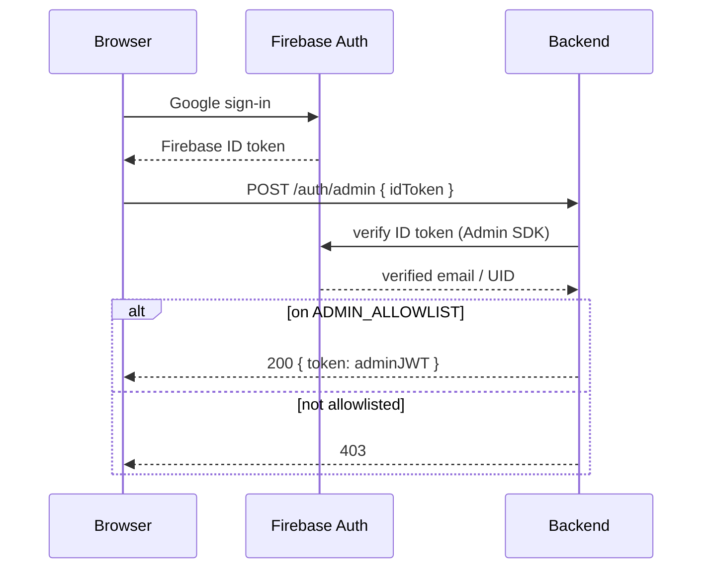
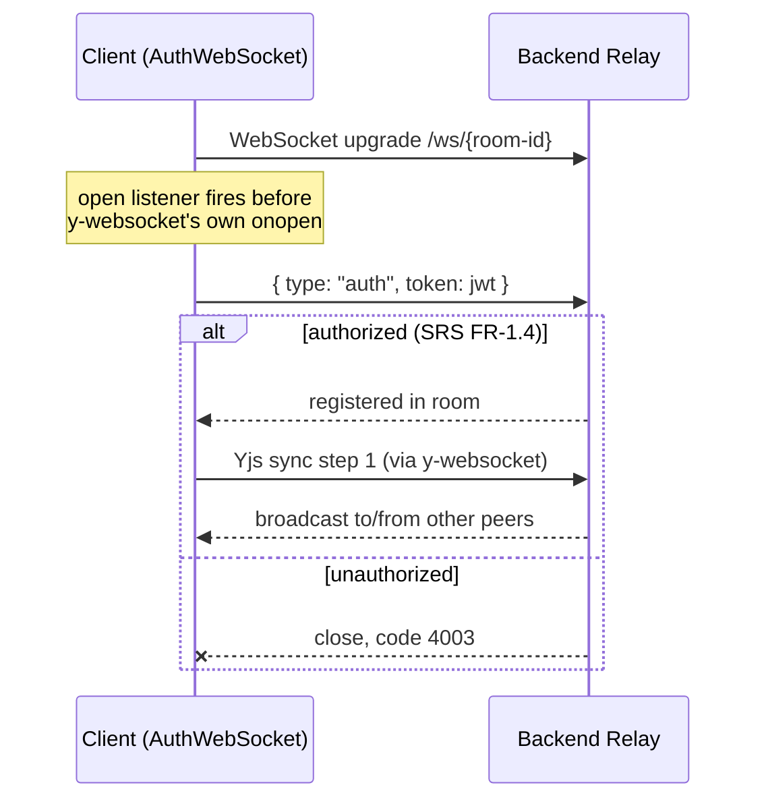
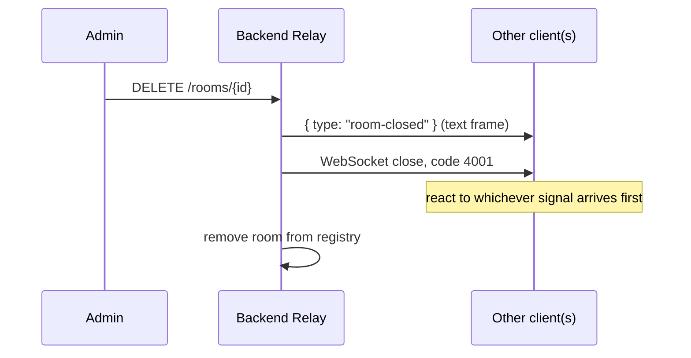
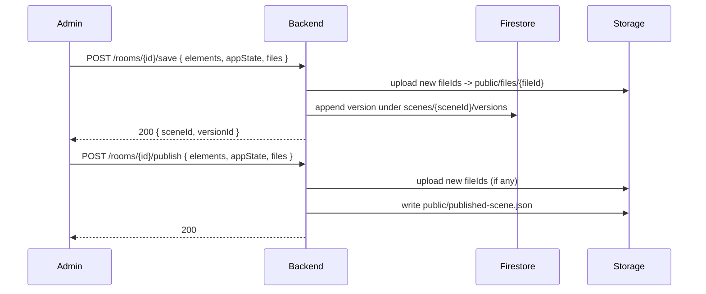

# Engineering Design Document

How the system in the [SRS](SRS.md) is actually built, and the reasoning
behind the choices that aren't obvious from reading the code. This
describes **current state** — the project was built in phases (visible in
git history) but this doc is not a phase log; it's organized by subsystem.

## Architecture at a Glance

```
                     ┌─────────────────────┐
  Browser  ───────►  │ Firebase Hosting CDN │  (static assets, rewrites)
                     └──────────┬───────────┘
                                │ /ws, /auth, /rooms, /scenes  (rewrite)
                                ▼
                     ┌─────────────────────┐
                     │  Cloud Run: backend  │  (Go, single service)
                     │  auth · rooms ·      │
                     │  relay · scenes      │
                     └──────┬───────┬───────┘
                             │       │  (Admin SDK, bypasses rules)
                             ▼       ▼
                      Firestore   Storage
                      (versions)  (published scene + image files)
```

The frontend never talks to Firestore/Storage directly for scene data —
every read/write is server-mediated. It talks to Firebase directly only for
**auth** (Google sign-in) and for reading the **public** Storage objects
(published scene JSON, image files), both allowed by the security rules in
`infra/firebase/`.

## Load-Bearing Design Decisions

These decisions shape multiple subsystems below; getting any one wrong
breaks something non-obvious elsewhere, so each is recorded here as a
short ADR (Context / Decision / Consequences) rather than buried in the
subsystem prose.

### A verified Google token is not authorization

**Context:** Firebase verification only proves the caller controls a
Google account — anyone can sign in with Google, not just the site owner.

**Decision:** Gate admin JWT issuance behind an additional allowlist check
(email/UID) at the `POST /auth/admin` exchange (SRS FR-1.2), on top of ID
token verification.

**Consequences:** Non-allowlisted Google users get `403` and never receive
write access. The site stays a single-admin-pool demo, not an open editor.

### Admin JWTs are not room-bound; guest JWTs are

**Context:** Admin JWTs are issued at sign-in, before any room exists, so
they can't carry a room claim the way guest JWTs — issued only once a
specific room's code is validated — naturally can (SRS FR-1.2/FR-1.3).

**Decision:** Authorize admins by role alone (any admin, any room) rather
than binding the JWT or checking room/document ownership; authorize guests
by an exact `room` claim match (SRS FR-1.4).

**Consequences:** An admin can rejoin any room without a code, and any
admin can act on any document — there is no per-document ownership. This
is acceptable because the admin pool is a small, trusted allowlist, not
multiple tenants (see PRD §Non-goals).

### The relay stores no document state — seeding is client-side

**Context:** The backend is a pure broadcast relay (§Relay below); it
never parses Yjs frames and so has no way to know a room's current canvas
contents.

**Decision:** When an admin opens a room seeded from a saved version, the
*opening client* applies the fetched version JSON into the shared Yjs doc
itself (SRS FR-2.4), not the server.

**Consequences:** A newly seeded room with no peer yet is fully
client-dependent — if the seeding admin disconnects before anyone else
joins, a later joiner starts blank. Accepted (see §Accepted Trade-offs).

### A room close is signaled twice

**Context:** A WebSocket close code is the natural "this room is gone"
signal, but an intermediary proxy in the request path isn't guaranteed to
preserve a non-standard close code end-to-end.

**Decision:** Broadcast both a `{type: "room-closed"}` text frame and a
close with code `4001` (SRS FR-2.7); clients react to whichever arrives
first.

**Consequences:** One redundant frame per close, in exchange for removing
a single point of failure in a signal every connected client depends on to
know it's time to leave.

### Image files bypass Firestore

**Context:** Firestore caps documents at 1 MiB, and Excalidraw already
content-hashes each image via its `fileId` — a natural dedup key Firestore
itself doesn't provide.

**Decision:** Relay image binaries over the same WebSocket as ordinary Yjs
traffic (live collaboration), and persist them content-addressed in
Storage at `public/files/{fileId}` (SRS FR-4.2), referenced by ID from
Firestore version documents rather than inlined.

**Consequences:** Images dedupe automatically across every version of
every document; Firestore documents stay small and text-only; Storage
gains a public-read surface, accepted because `fileId`s are unguessable
content hashes (SRS FR-4.7).

### Documents and rooms are decoupled but 1:1-at-most-live

**Context:** An earlier rooms/scenes split let opening a saved scene
always fork a brand-new room, so two people opening the same document
independently would silently drift apart with no way to reconcile.

**Decision:** Add a `bySceneID` index and an atomic
`POST /scenes/{id}/open` (SRS FR-2.2) that returns a document's existing
live room or creates one — never two.

**Consequences:** The frontend can treat "open a document" as always
canonical. The product behaves like Google Docs — one live session per
document — instead of ad hoc, forkable rooms.

## Backend (`backend/internal/`)

Go, one binary (`backend/main.go`), wired by dependency injection at
startup — no framework, `net/http.ServeMux` with Go 1.22+ method/path
patterns.

| Package | Responsibility |
|---|---|
| `config` | Loads and validates env-based config; fails startup (not first request) on missing required vars. |
| `firebaseapp` | Constructs the Firebase Admin SDK app, with or without credentials depending on emulator/in-memory mode. |
| `token` | JWT issuance/parsing (`golang-jwt/jwt`, HS256). |
| `auth` | `adminLogin`/`guestLogin` (see openapi.yaml), JWT verification middleware, allowlist check, per-IP guest rate limiting. |
| `rooms` | In-memory `Registry`: room lifecycle, the `bySceneID` index enforcing at-most-one-live-room-per-document, code/ID generation. |
| `relay` | The WebSocket handler: per-client send goroutine, auth-frame handshake, opaque broadcast, dual close-signal on room close. |
| `scenes` | `Store`/`BlobStore` interfaces with two implementations each: Firestore/GCS (production) and in-memory (dev, tests). |
| `httpapi` | REST handlers for rooms and scenes that sit above `rooms`/`scenes`/`auth`. |
| `web` | Small shared HTTP helpers (JSON response writing). |

### API Reference

The concrete route table (methods, paths, auth, payload shapes) lives in
[openapi.yaml](openapi.yaml), not here — sections below reference its
operations by `operationId` where relevant.

`createRoom` still accepts a deprecated `sceneId` body field for one
deploy cycle of backward compatibility; new clients use `openScene`
instead (SRS FR-2.2). Remove once no old frontend build depends on it —
see `backend/internal/httpapi/rooms.go`.

### Auth

Both exchanges produce the same JWT shape (`{sub, role, room, exp}`); why
their contents differ (admin: no room, valid everywhere / guest: bound to
one room) is the [ADR above](#admin-jwts-are-not-room-bound-guest-jwts-are).
Implementation-wise: both exchanges and the allowlist check live in
`auth/handlers.go`; the authorization branch in `auth/middleware.go`
switches on role per that asymmetry; guest-code attempts are rate-limited
per IP in `auth/ratelimit.go`, since the 4-char, 27-symbol code space
(~530k combinations) is otherwise brute-forceable in a session.



### Rooms

`rooms.Registry` is a mutex-guarded in-memory map, deliberately not
persisted — restart-losing live sessions is an accepted trade-off (SRS
NFR-1), since a room is a *session*, not a *record* (the record is the
Firestore document, once saved).

`GetOrCreateForScene` (backed by the `bySceneID` index) is the sole
internal entry point that can create a scene-bound room — the thing that
turns the [atomic-open ADR above](#documents-and-rooms-are-decoupled-but-11-at-most-live)
from a convention into an enforced invariant.

Room codes and IDs (`rooms/generate.go`) are drawn from
`crypto/rand`, not `math/rand` — codes are a security boundary (guest auth,
SRS FR-1.3), so they need to be unguessable, not just well-distributed. The
code alphabet (`BCDFGHJKMNPQRSTVWXYZ2345679`) excludes `0/O/1/I/L` for
legibility when read aloud or over a screen share.

### Relay

`relay.Handler` is intentionally protocol-blind: it never parses a Yjs
frame, only forwards bytes between clients in the same room. This keeps the
backend simple and, more importantly, decouples the server from the
frontend's choice of CRDT library — the relay would be unchanged if the
frontend swapped Yjs for something else.

Each client has a dedicated write goroutine draining a channel, because
`gorilla/websocket` connections aren't safe for concurrent writes and
multiple other goroutines (broadcast fan-out, the close sequence) need to
write to a given client.



**Closing a room sends two redundant signals** — a `{type: "room-closed"}`
text frame, then a close with code `4001` — because there's no guarantee an
intermediate proxy preserves a non-standard WebSocket close code end to
end (see the [ADR](#a-room-close-is-signaled-twice) above). The frontend's
`authSocket.ts` reacts to whichever arrives.



### Persistence

Firestore holds only text (`elements`/`appState` as JSON strings +
metadata) — image binaries are kept out entirely, per the
[Image files bypass Firestore](#image-files-bypass-firestore) decision
above.

`scenes.Store`/`scenes.BlobStore` are interfaces specifically so the
in-memory implementation can back both local dev without Firebase
(`DISABLE_PERSISTENCE=true`) and backend unit tests, with the exact same
`httpapi` code path exercised in both cases.

Security is enforced at two independent layers that must agree: Firestore
rules deny all client access outright (every read *and* write goes through
the Admin SDK); Storage rules allow public read only under `public/**` and
deny all client writes. Since the experiment's images aren't sensitive and
`fileId`s are unguessable content hashes, public read there is treated as
an acceptable simplification rather than a gap.



## Frontend (`frontend/src/`)

Vite + React 19 + Excalidraw 0.18, no server-side rendering — the CDN
serves a static SPA shell for every route; the app decides client-side
whether to render the read-only published scene or a live room.

| Directory | Responsibility |
|---|---|
| `auth/` | Firebase JS SDK wrapper — Google sign-in, ID token retrieval. |
| `api/` | Typed REST client (`client.ts`) and public-Storage fetch helpers (`storage.ts`). |
| `session/` | `useSession` — the one hook owning admin/room state and every session-changing action; see `Session` in `session/useSession.ts`. |
| `collab/` | Everything CRDT/transport: the Yjs binding (`sync.ts`, `useCollaborativeSync.ts`), awareness (`awareness.ts`), the auth-frame WebSocket subclass (`authSocket.ts`, `transport.ts`), version-restore logic (`restoreVersion.ts`), and `CollaborativeCanvas.tsx`, the thin render component. |
| `hooks/` | Small cross-cutting hooks, e.g. `useLatestOnly` (stale-async-response guard). |
| `ui/` | The flyout panel and its contents: `DocumentsPanel`/`DocumentControls` (not-in-room / in-room), `VersionHistory(Panel)`, `PublishedScene`, `FlyoutPanel`, `ContextMenu`. |

`App.tsx` is the entire routing logic: `session.room ? <RoomView> :
<LandingView>`. There's no router — the two views are the whole app.

### Session state (`session/useSession.ts`)

One hook is the source of truth for "am I signed in" and "am I in a room,"
and every mutating action (`createDocument`, `openScene`, `joinAsGuest`,
`renameDocument`, `closeRoom`, ...) lives on the returned `Session` object.
Components consuming it take **narrow `Pick<Session, ...>` slices**, not
the whole object — `DocumentControls`/`DocumentsPanel` each declare exactly
the fields they use, so a component can be tested or reused against a
partial mock and a `Session` field change only forces a re-check of call
sites that actually reference it.

`useSession` re-exchanges a Firebase session for a fresh backend JWT on
every load (`onAuthStateChanged`), so a page refresh doesn't force a
re-sign-in. Because that exchange is async and Firebase can fire the
callback again (sign-out, a different sign-in) before it resolves, the
handler uses `useLatestOnly` — a small sequence-token guard
(`hooks/useLatestOnly.ts`) — to drop a stale exchange's result if a newer
auth event has already superseded it. Without this, a slow first sign-in
resolving after a second sign-in (or a sign-out) could silently clobber the
already-correct state with stale data.

### The Yjs binding (`collab/`)

This is the subtlest part of the codebase; Excalidraw 0.18 has
collaboration *hooks* but no built-in CRDT provider, so the binding below
is hand-rolled. Facts here were verified against
`@excalidraw/excalidraw@0.18.0` directly (not assumed from docs), because
several of them are easy to get wrong and fail silently:

- **Send the auth frame before Yjs sync.** A `WebSocket` subclass
  (`authSocket.ts`) passed as `y-websocket`'s `WebSocketPolyfill` sends the
  auth frame from an `open` listener registered in its constructor — before
  `y-websocket` attaches its own `onopen` (which starts sync). WebSocket
  delivery is ordered, so the auth frame is guaranteed to arrive first, with
  no server ack required.
- **Elements are bound via a `Y.Map<id, element>`, gated on version.** Local
  changes read `getSceneElementsIncludingDeleted()` (not the `onChange`
  callback's own argument, which omits deleted elements) and write to the
  map only when the incoming `version` is newer than what's stored. That one
  rule handles adds, updates, deletions, *and* suppresses the echo of a
  remote element being applied back onto itself.
- **Deletions are updates, not map deletions.** Excalidraw marks
  `isDeleted: true` and bumps `version` rather than removing the element;
  `yMap.delete(id)` is never called, because deleting the key would let a
  later-joining peer never learn the element was deleted (it would just be
  absent, indistinguishable from "never existed" — but worse, a peer that
  already has it would never see the tombstone and could resurrect it).
- **Remote applies are marked non-undoable** (`captureUpdate:
  CaptureUpdateAction.NEVER` on every remote-sourced `updateScene`) — without
  it, a collaborator's edits would pollute this client's own undo/redo
  stack.
- **An `isApplyingRemote` guard breaks the echo loop**: `updateScene` itself
  re-fires `onChange`, which would otherwise immediately write the just-applied
  remote change straight back into the Y.Map.
- **Z-order comes from Excalidraw's fractional `index` field, not Map
  iteration order** — a `Y.Map` is unordered, so ordering must be
  data-derived; this only works because v0.18 added a branded
  `FractionalIndex` string per element.
- **Image files are a second, add-only `Y.Map<fileId, BinaryFileData>`** —
  separate from `updateScene`, applied via `excalidrawAPI.addFiles([...])`,
  and applied *before* the elements that reference them to avoid a flash of
  broken images. No versioning or deletion logic is needed because
  `fileId`s are content hashes and therefore immutable.
- **`appState` (viewport, zoom) never goes through Yjs** — it's inherently
  per-user; only `elements` and `files` are shared. `appState` is read only
  at save/publish time.
- **Room-close handling is symmetric with the relay's dual signal**: the
  frontend reacts to *either* the `{type: "room-closed"}` message *or* close
  code `4001`.

`sync.ts`/`awareness.ts`/`restoreVersion.ts` hold the pure, unit-tested CRDT
logic; `useCollaborativeSync.ts` is the React-effect glue that wires that
logic to a live `ExcalidrawImperativeAPI` and a `WebsocketProvider`; and
`CollaborativeCanvas.tsx` is deliberately thin — it owns only the `initialData`
handling quirk below and renders `<Excalidraw>`, calling the hook for its
side effect. This split exists so a change to *what's rendered* (e.g. a
toolbar overlay) never requires reading sync internals, and a change to
*how sync works* never touches the render tree.

**`initialData` timing quirk**: Excalidraw defers mounting its real editor
behind an internal async language-pack load, so it does *not* consume
`initialData` on the component's first commit as one might expect.
`CollaborativeCanvas` holds the seed until the imperative API callback fires
(which only happens once the real editor has mounted and already read
`initialData`), then drops its copy — clearing on a bare mount effect
would race the language-pack load and reliably lose the seed.

## Deployment Architecture

Infrastructure is Terraform-managed — see [deploy.md](deploy.md) for the
full resource list and the runbook. The two settings this design actually
depends on are SRS NFR-2 and NFR-3: Cloud Run's extended timeout and
`min_instance_count`, and HTTP/1 rather than end-to-end HTTP/2, both
required for long-lived WebSockets to survive. CI (GitHub Actions)
builds/pushes the backend image and deploys the frontend to Firebase
Hosting on every merge to `main`.

## Testing

Every package with non-trivial logic carries unit tests runnable without
external services (`make test` = backend `go test ./...` + frontend
`npm test`): the auth/rate-limit/token packages, the room registry, the
relay (a real two-client integration test), both scene store
implementations, and — on the frontend — the pure `sync`/`awareness`/
`restoreVersion` logic in isolation from React. End-to-end behavior (auth,
save, publish, multi-browser collaboration) is verified manually against
the Firebase emulators; see [dev.md](dev.md#full-end-to-end-test-two-browsers).

## Accepted Trade-offs

- **Room state doesn't survive a restart.** A deploy or crash drops every
  live session; participants get bounced and admins re-open the document.
  Saved documents (Firestore) are unaffected.
- **A joiner with no live peer and no admin-seeded state starts blank.**
  Seeding only happens client-side, from the creating admin; if that admin
  is gone before anyone else joins, there's nothing to sync from.
- **Firestore's version-history delete isn't atomic with the scene-document
  delete** (`FirestoreStore.DeleteScene` uses `BulkWriter` for the
  subcollection) — a crash mid-delete could leave orphaned version docs.
  Accepted because it's a rare admin action with no user-facing consequence
  beyond unreclaimed storage.
- **Single Cloud Run service, no HA for live rooms.** `min_instance_count=1`
  keeps one instance warm, but rooms aren't replicated or shard across
  instances — this is an experimental project's traffic profile, not a
  multi-tenant product's.
- **Public read access to all Storage `public/**` objects** — acceptable
  because image `fileId`s are unguessable content hashes and none of the
  content is sensitive (SRS FR-4.7).
